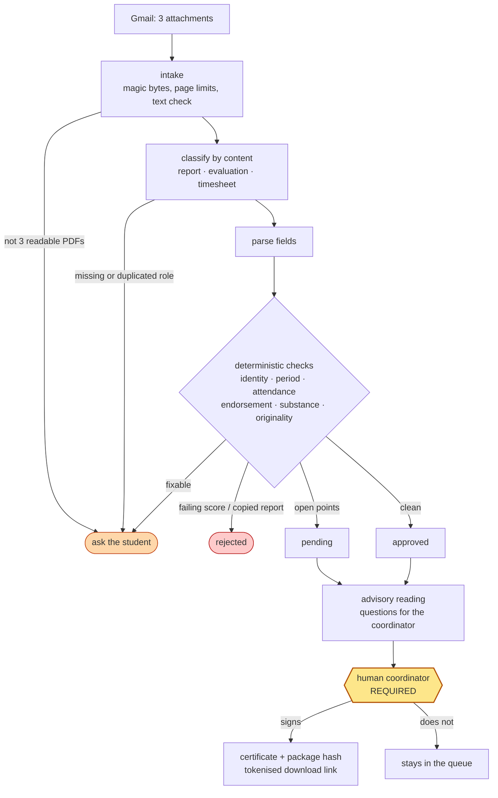

<div align="center">

# 🎓 Internship Report Reviewer

**A student finishes a placement and emails three PDFs. This service checks them, tells the student exactly what to correct, and — only when a coordinator says so — issues a signed completion certificate.**


</div>

---

## The decision this is built around

A completion certificate is not a summary. It is an institutional claim about a real person — that they attended twenty days at a named company — and a registrar will act on it.

The tempting design is to hand the three documents to a language model and ask "is this a valid internship?" That version is wrong in ways that only surface later:

- **It cannot explain itself.** A student rejected for eighteen days of attendance can be shown the eighteen dates. A student rejected because a model found the report unconvincing can be shown nothing, and has no idea what to fix.
- **It is not stable.** The same package must produce the same verdict in October that it produced in September.
- **It is the wrong tool.** The evidence for "this internship happened" is countable: dates, hours, a supervisor's signature, a score. Counting is what computers are trustworthy at.

So the split is:

| | decides the outcome | can reject | can sign |
|---|---|---|---|
| **Deterministic checks** | ✅ everything | ✅ | ❌ |
| **Language model** | ❌ nothing | ❌ | ❌ |
| **Named coordinator** | final call | — | ✅ |

The model reads the report, raises questions for the coordinator, and drafts the student's email. It runs *after* the status is already fixed, and **the service decides identically with it switched off** — deleting your API key changes nothing about who gets a certificate.

That has a practical payoff: **a package is never held because an API was down.** Systems where the model produces the score do not get that for free.

---

## What arrives

One email, three attachments:

| Role | Document | Written by | Why it is needed |
|---|---|---|---|
| `report` | Internship Report | the student | What they say they did |
| `evaluation` | Employer Evaluation Form | workplace supervisor | The only independent voice in the package |
| `timesheet` | Attendance Record | host organisation | The countable claim: which days, how many hours |

**Filenames are never trusted.** Attachments are classified by reading them ([`report_extraction.py`](backend/app/services/report_extraction.py)). Renaming `report.pdf` to `attendance.pdf` changes nothing, and neither does the order the mail client presents them in.

---

## Nobody is refused for something they can fix

Only **two** findings reject a package:

| Finding | Why it is final |
|---|---|
| `EVAL_SCORE_LOW` | The supervisor assessed the work as failing. That is a judgement; resending cannot change it. |
| `REPORT_NOT_ORIGINAL` | The report matches another accepted submission. Needs a conversation, not a new attachment. |

Everything else — an unsigned form, nineteen days instead of twenty, a name that does not match across the three documents, a scan with no readable text — lands at `request_clarification` with a specific instruction:

```
2. Only 18 attended working days could be verified; 20 are required.
   What to do: Submit an attendance record showing at least 20 attended
   working days of at least 4 hours each, inside the declared internship
   period. If you did work those days, ask the company to reissue the record.
```

Every actionable finding carries that instruction, the student's email is assembled from them, and **a test enforces it** — a request the student cannot act on is a bug, not a style problem.

Statuses: `approved` (waiting for a signature) · `pending` (open points, a human should look) · `request_clarification` · `rejected` · `signed`.

---

## What it catches that a single document cannot

The realistic failure mode for internship reports is not fabrication, it is **circulation**: last year's cohort passes its reports down, or two students at the same company submit one document with the names swapped. Every copy is individually perfect, so no per-document check sees it.

Each accepted report is therefore kept as a TF-IDF vector and every new report scored against all of them ([`report_similarity.py`](backend/app/services/report_similarity.py)). Plain Python — no dependency, no API cost — and it runs *before* the model is called, so a copied report costs nothing to reject. The corpus is rebuilt from SQLite at startup, so a restart does not amnesty a report copied from one accepted last week.

Two others worth naming:

- **Scans are refused.** A photograph of a signed form passes every text-based check *vacuously* — there is no text to contradict anything. Reporting that as verified would be worse than asking again.
- **Weekends do not pad the count.** Twenty weekdays plus the weekends between them is not twenty-six working days; the extras are excluded and reported, so a coordinator sees them either way.

Full reference: [`docs/report-review.md`](docs/report-review.md) — every finding code, its severity, and why.

---

## The certificate is bound to its documents

The signed certificate prints the **SHA-256 of the three attachments** on its face. A certificate detached from its documents attests to nothing — anyone holding it could pair it with a different report. With the hash printed, the claim is checkable: rehash the three files and compare. The hash is order-independent.

It also says what it does not claim:

> It attests to the completeness and internal consistency of the submitted record. It is not an assessment of the quality of the work performed.

Signing is **refused** for a rejected package, and refused for one still waiting on the student — signing past a missing supervisor signature would produce a certificate resting on a document nobody signed. A package with open points can be signed with `acknowledge_warnings`, and the acknowledged codes are printed on the certificate.

---

## Flow



Intake failures **short-circuit**: if the evaluation form is missing, the pipeline stops and says so rather than running twenty content checks and burying the one thing that needs fixing under nineteen that are downstream of it.

---

## Running it

```bash
cd backend && pip install -r requirements.txt && uvicorn app.main:app --reload
```

For the tests, `pip install -r backend/requirements-dev.txt` — pytest and httpx
are kept out of `requirements.txt` so they do not ship in the production image.

```bash
cd frontend && npm install && npm run dev
```

Interactive API docs at `http://127.0.0.1:8000/docs`, dashboard at `http://localhost:5173`.

Or the whole stack:

```bash
docker compose up --build
```

### Try it without an email account

The repo generates its own test data — including the failures, which are the interesting part.

```bash
python testdocs/tool/completion_docs.py --all --out samples
```

Nine scenarios, each perturbing exactly one thing so a firing check is diagnostic: `clean`, `short-days`, `name-mismatch`, `unsigned`, `thin-report`, `weekend-pad`, `future-dates`, `scan`, `copied`. Expected outcomes live in the `EXPECTED` dict in that module. All data is synthetic.

---

## API

| Method | Endpoint | Purpose |
|---|---|---|
| `POST` | `/reports/` | Review a package: `intern_email` + three `files` (+ optional `application_id`) |
| `POST` | `/reports/from-n8n` | Same, behind the shared Bearer token |
| `GET` | `/reports/` | Coordinator queue. `?status=pending` to filter |
| `GET` | `/reports/by-id/{id}` | Full result: findings, documents, advisory reading |
| `GET` | `/reports/by-id/{id}/attachments/{role}` | Read back a submitted document |
| `POST` | `/reports/by-id/{id}/sign` | **The human gate.** Requires `coordinator_name` |
| `GET` | `/reports/by-id/{id}/certificate?token=` | Signed certificate, re-downloadable |
| `GET` | `/reports/for-application/{id}` | Every attempt under one caller-supplied reference |
| `GET` | `/health` | Service + AI status |

A held or rejected package returns **HTTP 201 with the status in the body**, not a 4xx. It is a normal outcome, not a protocol error, and n8n should not have to tell them apart.

---

## Dashboard

React + Vite. Dark by default, light on request, and it follows the system
preference until you pick one. Inter is bundled into the build rather than
pulled from a font CDN — the app should look right inside a university network
with no route to the open internet.

There is no navigation sidebar: this service does one thing, so the width goes
to findings text and document hashes instead. The queue is grouped by **who has
to act next** — *To sign*, *With student*, *Signed* — rather than by raw status,
because that is the question when you are working a queue.

Opening a submission shows the figures the certificate would assert, the findings grouped by what they demand (things the student must fix separated from things the coordinator should decide), the exact wording the student was emailed, and the three PDFs with their hashes.

The signature panel does not appear at all for a package that is rejected or still waiting on the student, and one carrying open points needs the box ticked before the button enables — the same refusals the API makes, made visible instead of arriving as an error after the fact.

---

## Email wiring

[`n8n/internship-report-review-workflow.json`](n8n/internship-report-review-workflow.json) — Gmail trigger on subject `Internship Report` → `POST /reports/from-n8n` → reply to the student, and notify the coordinator when a package needs one.

It posts the PDFs themselves rather than extracted text, because the backend hashes the exact bytes onto the certificate and refuses scans — extracting in n8n would throw both away. The workflow **stops** at notifying the coordinator; signing is a deliberate action in the dashboard.

Setup: [`docs/n8n-integration.md`](docs/n8n-integration.md).

---

## Tests

```bash
cd backend && pytest
```

55 tests, hermetic and offline — no network, temp database. That is possible precisely because nothing in the decision path calls an API.

The gate tests break one property of a valid package and assert the finding **and its severity**. Severity is the part worth asserting: a check that rejects where it should ask for a correction refuses a student for something they could have fixed, and "some finding fired" would not catch it. The API tests run real generated PDFs through the full HTTP surface — real text extraction, real certificate rendering, real signature embedding.

The ones worth reading are the refusals:

- `test_fixable_problems_ask_for_a_correction_rather_than_rejecting` (11 cases)
- `test_a_rejection_outranks_a_clarification` — a student whose employer failed them is not also told to chase a stamp
- `test_a_package_awaiting_the_student_cannot_be_signed`
- `test_open_points_must_be_acknowledged_before_signing`
- `test_every_actionable_finding_carries_a_remedy`
- `test_exactly_the_minimum_passes` — a boundary that rejects the compliant case is worse than no boundary
- `test_names_fold_for_comparison` — `ELİF ŞAHİN`, `Michał Łukasiewicz`: Turkish dotted I and Polish crossed L do not survive naive case folding, and a package must not be held because a company typed a name in capitals

---

## What this does not do

- **It does not judge the work.** Word count and section presence catch an empty submission; they are not a grade. Judging the report is the coordinator's job, which is what the advisory reading is for.
- **It does not verify the company exists**, or that the supervisor is real. It checks the internal consistency of the submitted record. A forged evaluation form with a plausible score passes, and should — catching that needs a channel this service does not have.
- **It does not sign anything by itself.** That is not a limitation.

---

## License

MIT — see [LICENSE](LICENSE).
